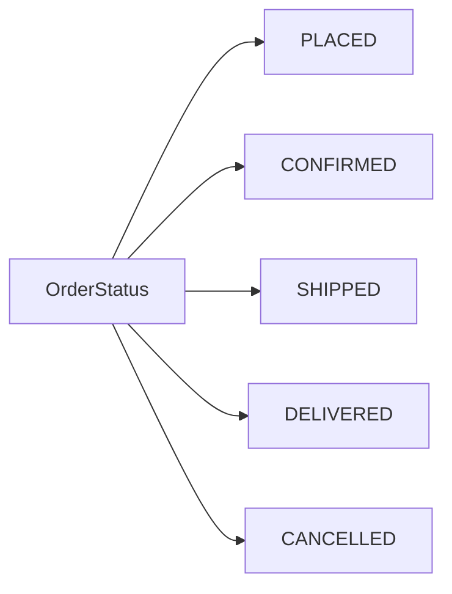
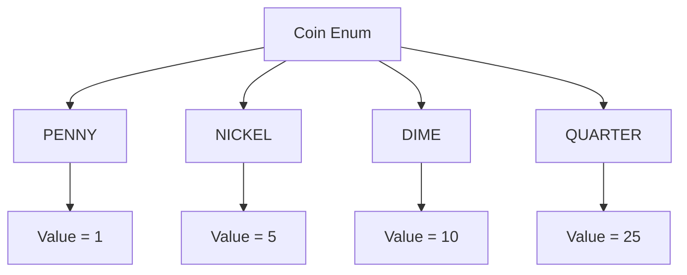
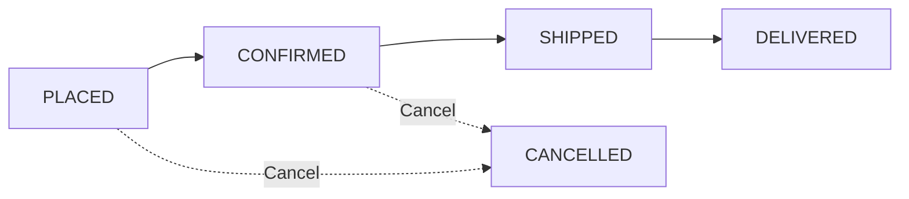

# Enums in Java

> **Enums** are used when a value can only be one of a **predefined, fixed set of options**.

---

## 1. What is an Enum?

An **enum** (enumeration) is a special data type used to define a **fixed set of named constants**.

For example, an order can have only a few valid states:

```text
PLACED → CONFIRMED → SHIPPED → DELIVERED
                 ↘
                CANCELLED
```

Instead of representing these states using arbitrary strings or integers, Java allows us to define them as an enum.

```java
enum OrderStatus {
    PLACED,
    CONFIRMED,
    SHIPPED,
    DELIVERED,
    CANCELLED
}
```

Now `OrderStatus` can only represent one of the values defined above.

### Core Idea



The important idea is:

> **If a value can only be one of a predefined set of options, consider using an enum.**

---

# 2. Why Do We Need Enums?

Suppose we represent an order status using a `String`.

```java
String status = "SHIPPED";
```

This looks simple, but there is a problem.

Someone could accidentally write:

```java
String status = "Shiped";
```

The program still compiles because `"Shiped"` is a perfectly valid `String`.

The error is discovered only at runtime when the application doesn't recognize the value.

---

## Problem with Strings

```java
String status = "PNDING";  // Typo
```

The compiler has no idea that `"PNDING"` is supposed to be `"PENDING"`.

---

## Problem with Integers

Another approach is to use numbers:

```java
int PLACED = 1;
int CONFIRMED = 2;
int SHIPPED = 3;
int DELIVERED = 4;
```

Then we might write:

```java
if (status == 3) {
    // What does 3 mean?
}
```

The problem is that `3` has no obvious meaning.

This is called a **magic value / magic number**.

---

## Enum Solution

```java
enum OrderStatus {
    PENDING,
    CONFIRMED,
    SHIPPED,
    DELIVERED
}
```

Now we can write:

```java
OrderStatus status = OrderStatus.SHIPPED;
```

This is much clearer than:

```java
int status = 3;
```

---

# 3. Advantages of Enums

### 1. Avoid Magic Values

Instead of:

```java
int status = 3;
```

use:

```java
OrderStatus status = OrderStatus.SHIPPED;
```

The code communicates its meaning directly.

---

### 2. Improve Readability

Compare:

```java
if (status == 3) {
    // ...
}
```

with:

```java
if (status == OrderStatus.SHIPPED) {
    // ...
}
```

The second version is immediately understandable.

---

### 3. Type Safety

An enum restricts a variable to the values defined by that enum.

```java
enum OrderStatus {
    PENDING,
    SHIPPED,
    DELIVERED
}
```

This is valid:

```java
OrderStatus status = OrderStatus.SHIPPED;
```

But this is not:

```java
OrderStatus status = "SHIPPED";
```

The compiler catches the mistake.

---

### 4. Better IDE Support

IDEs can provide:

* Auto-completion
* Refactoring support
* Compile-time checks
* Easier navigation

---

### 5. Fewer Bugs

Because only predefined enum values are allowed, accidental values and typos are caught much earlier.

---

# 4. When Should You Use an Enum?

Enums are a good choice when a value belongs to a **fixed set of possible options**.

Common examples:

| Use Case       | Enum Values                       |
| -------------- | --------------------------------- |
| Order status   | `PENDING`, `SHIPPED`, `DELIVERED` |
| User role      | `ADMIN`, `CUSTOMER`, `DRIVER`     |
| Vehicle type   | `CAR`, `BIKE`, `TRUCK`            |
| Direction      | `NORTH`, `SOUTH`, `EAST`, `WEST`  |
| Payment method | `CARD`, `CASH`, `UPI`             |
| Priority       | `LOW`, `MEDIUM`, `HIGH`           |

### General Rule

```text
Fixed set of valid choices
            ↓
          Enum
```

---

# 5. Simple Enum

The simplest enum contains a list of constants.

```java
enum OrderStatus {
    PENDING,
    CONFIRMED,
    SHIPPED,
    DELIVERED
}
```

We can use it like this:

```java
public class Main {

    public static void main(String[] args) {

        OrderStatus status = OrderStatus.SHIPPED;

        System.out.println(status);
    }
}
```

### Output

```text
SHIPPED
```

---

## Accessing Enum Constants

Enum constants are accessed using:

```java
EnumName.CONSTANT
```

Example:

```java
OrderStatus.PENDING
OrderStatus.CONFIRMED
OrderStatus.SHIPPED
OrderStatus.DELIVERED
```

---

# 6. Comparing Enums

Enums can be compared using `==`.

```java
OrderStatus status = OrderStatus.SHIPPED;

if (status == OrderStatus.SHIPPED) {
    System.out.println("Order has been shipped.");
}
```

For enum constants, `==` is safe and commonly preferred.

---

# 7. Enums with Properties

Enums don't have to contain only constants.

An enum can also have:

* Fields
* Constructors
* Methods
* Behavior

For example, suppose we want to represent different coins and their values.

```java
enum Coin {

    PENNY(1),
    NICKEL(5),
    DIME(10),
    QUARTER(25);

    private final int value;

    Coin(int value) {
        this.value = value;
    }

    public int getValue() {
        return value;
    }
}
```

Each enum constant now has its own value.

### Conceptual Structure



Usage:

```java
Coin coin = Coin.QUARTER;

System.out.println(coin.getValue());
```

Output:

```text
25
```

This keeps the data associated with the constant itself instead of maintaining a separate lookup structure.

---

# 8. Enum Constructors

An enum can have a constructor.

```java
enum PaymentMethod {

    CASH(0.0),
    CARD(2.5),
    UPI(1.0);

    private final double fee;

    PaymentMethod(double fee) {
        this.fee = fee;
    }

    public double getFee() {
        return fee;
    }
}
```

Here:

```java
CASH(0.0)
CARD(2.5)
UPI(1.0)
```

pass values to the enum constructor.

The constructor is called automatically when the enum constants are created.

---

# 9. Enums Can Have Methods

Enums can contain behavior just like classes.

```java
enum PaymentMethod {

    CASH(0.0),
    CARD(2.5),
    UPI(1.0);

    private final double fee;

    PaymentMethod(double fee) {
        this.fee = fee;
    }

    public double getFee() {
        return fee;
    }
}
```

Usage:

```java
PaymentMethod method = PaymentMethod.CARD;

System.out.println(method.getFee());
```

Output:

```text
2.5
```

This is useful because the data and behavior related to a particular concept stay together.

---

# 10. Practical Example — Order Processing System

Enums become particularly useful when modeling a real business domain.

Consider an e-commerce order.

An order can have:

```text
PLACED
   ↓
CONFIRMED
   ↓
SHIPPED
   ↓
DELIVERED
```

An order may also be cancelled before shipping.

### Order Status

```java
enum OrderStatus {
    PLACED,
    CONFIRMED,
    SHIPPED,
    DELIVERED,
    CANCELLED
}
```

### Payment Method

```java
enum PaymentMethod {

    CASH(0.0),
    CARD(2.5),
    UPI(1.0);

    private final double fee;

    PaymentMethod(double fee) {
        this.fee = fee;
    }

    public double getFee() {
        return fee;
    }
}
```

---

# 11. Modeling Order Transitions

We can use the enum to control which states an order can move through.



For example:

```java
public void advanceStatus() {

    switch (status) {

        case PLACED:
            status = OrderStatus.CONFIRMED;
            break;

        case CONFIRMED:
            status = OrderStatus.SHIPPED;
            break;

        case SHIPPED:
            status = OrderStatus.DELIVERED;
            break;

        case DELIVERED:
            break;

        case CANCELLED:
            break;
    }
}
```

This makes the valid transitions explicit.

You cannot simply move:

```text
PLACED → DELIVERED
```

without implementing that transition.

Similarly, going backwards:

```text
SHIPPED → CONFIRMED
```

is not part of the defined lifecycle.

---

# 12. Enforcing Business Rules

Enums can also make business rules easier to express.

For example, suppose an order can only be cancelled **before shipping**.

```java
public boolean cancel() {

    if (status == OrderStatus.PLACED ||
        status == OrderStatus.CONFIRMED) {

        status = OrderStatus.CANCELLED;
        return true;
    }

    return false;
}
```

Now the rule is clear:

```text
PLACED ────────┐
               ├──→ CANCELLED
CONFIRMED ─────┘

SHIPPED ──X──→ CANCELLED
```

---

# 13. Complete Example

```java
enum OrderStatus {
    PLACED,
    CONFIRMED,
    SHIPPED,
    DELIVERED,
    CANCELLED
}
```

```java
enum PaymentMethod {

    CASH(0.0),
    CARD(2.5),
    UPI(1.0);

    private final double fee;

    PaymentMethod(double fee) {
        this.fee = fee;
    }

    public double getFee() {
        return fee;
    }
}
```

```java
class Order {

    private OrderStatus status;
    private final PaymentMethod paymentMethod;
    private final double amount;

    public Order(
            OrderStatus status,
            PaymentMethod paymentMethod,
            double amount) {

        this.status = status;
        this.paymentMethod = paymentMethod;
        this.amount = amount;
    }

    public void advanceStatus() {

        switch (status) {

            case PLACED:
                status = OrderStatus.CONFIRMED;
                break;

            case CONFIRMED:
                status = OrderStatus.SHIPPED;
                break;

            case SHIPPED:
                status = OrderStatus.DELIVERED;
                break;

            default:
                break;
        }
    }

    public boolean cancel() {

        if (status == OrderStatus.PLACED ||
            status == OrderStatus.CONFIRMED) {

            status = OrderStatus.CANCELLED;
            return true;
        }

        return false;
    }

    public void displayOrder() {

        System.out.println("Status: " + status);
        System.out.println("Payment: " + paymentMethod);
        System.out.println("Amount: " + amount);
        System.out.println("Payment Fee: " + paymentMethod.getFee());
    }
}
```

---

# 14. Why This Design Is Good

### Status transitions are controlled

The enum + transition logic defines exactly how an order can move through its lifecycle.

```text
PLACED
   ↓
CONFIRMED
   ↓
SHIPPED
   ↓
DELIVERED
```

This avoids arbitrary state changes.

---

### Payment information is self-contained

Instead of maintaining a separate map:

```java
Map<PaymentMethod, Double>
```

the fee is stored directly with the enum constant.

```java
CARD(2.5)
UPI(1.0)
CASH(0.0)
```

The data stays close to the concept it belongs to.

---

### Business rules become readable

Compare:

```java
if (status == 3)
```

with:

```java
if (status == OrderStatus.SHIPPED)
```

The enum-based version clearly communicates the business meaning.

---

### Easy to extend

Suppose we need another payment method:

```java
WALLET(1.5)
```

We can add it directly to the enum.

Similarly, a new order state such as:

```java
RETURNED
```

can be added to `OrderStatus`, after which the compiler/IDE can help identify places where the new state needs handling.

---

# 15. Enum vs String vs Integer

| Feature                 |  String | Integer | Enum |
| ----------------------- | ------: | ------: | ---: |
| Type-safe               |       ❌ |       ❌ |    ✅ |
| Readable                |       ✅ |       ❌ |    ✅ |
| Prevents invalid values |       ❌ |       ❌ |    ✅ |
| Avoids magic values     |       ❌ |       ❌ |    ✅ |
| IDE auto-completion     | Limited | Limited |    ✅ |
| Can contain behavior    |       ❌ |       ❌ |    ✅ |
| Good for fixed choices  |      ⚠️ |       ❌ |    ✅ |

---

# 16. Common Use Cases

### Order Status

```java
enum OrderStatus {
    PENDING,
    CONFIRMED,
    SHIPPED,
    DELIVERED,
    CANCELLED
}
```

### User Role

```java
enum UserRole {
    ADMIN,
    CUSTOMER,
    DRIVER
}
```

### Vehicle Type

```java
enum VehicleType {
    CAR,
    BIKE,
    TRUCK
}
```

### Direction

```java
enum Direction {
    NORTH,
    SOUTH,
    EAST,
    WEST
}
```

---

# 17. Key Takeaways

> **Enum = Fixed set of named, type-safe constants.**

Remember:

1. Use an enum when a value has a **predefined set of valid options**.
2. Enums provide **type safety**.
3. They eliminate many **magic strings and numbers**.
4. They improve **readability**.
5. Enum constants can have their own **fields, constructors, and methods**.
6. Enums are useful for modeling **states, categories, roles, and types**.
7. Enums are especially useful in LLD for representing **domain-specific states and rules**.
8. Keeping related data and behavior inside an enum can make a design cleaner and easier to maintain.

---

## Interview Answer

**What is an enum in Java?**

> An enum is a special Java data type used to represent a fixed set of predefined constants. It provides type safety and improves readability compared to using raw strings or integers. Java enums can also contain fields, constructors, and methods, making them useful for modeling domain concepts that have a fixed set of valid states or categories.

---

## Quick Revision

```text
                    ENUM
                      │
          Fixed set of valid values
                      │
        ┌─────────────┼─────────────┐
        ↓             ↓             ↓
    Type Safety   Readability   No Magic Values
        │
        ↓
 Can contain fields,
 constructors & methods
        │
        ↓
Useful for LLD domain modeling
```

**Rule of thumb:**

```text
"Can this value only be one of these
 specific predefined choices?"
                 │
              YES ↓
              Use ENUM
```
