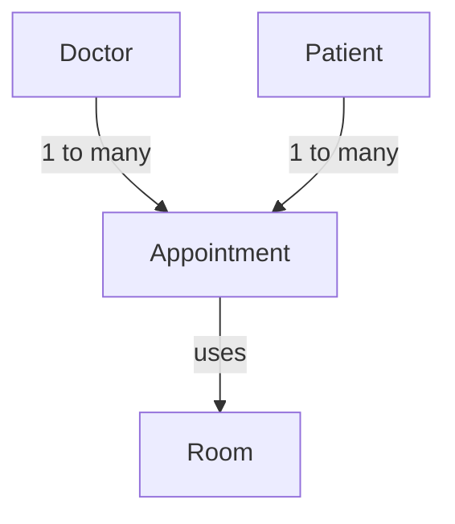

# Association in Object-Oriented Design

> **Association** is a relationship between two classes where objects of one class **use, communicate with, or reference** objects of another class.

In the real world, objects rarely exist in isolation.

For example:

* A `Doctor` has `Patients`.
* A `Driver` has a `Car`.
* A `Student` enrolls in `Courses`.
* An `Order` uses a `PaymentGateway`.

In Object-Oriented Design, these relationships are modeled using **association**.

---

# 1. What is Association?

Association represents a relationship between two classes where one object interacts with or references another object.

The simplest way to think about it is:

> **"One object needs to know about another object to perform its responsibility."**

For example:

```text
Student ───────── Teacher
```

A `Student` may have a `Teacher`, and the `Teacher` may teach multiple students.

However:

* A `Student` can exist without a particular `Teacher`.
* A `Teacher` can exist without a particular `Student`.
* Neither object owns the lifecycle of the other.

Therefore, this is an **association**.

---

## Real-World Example

```text
┌─────────────┐          ┌─────────────┐
│   Student   │──────────│   Teacher   │
└─────────────┘          └─────────────┘
       │                        │
       │                        │
  can exist                can exist
  independently             independently
```

The relationship exists, but the objects have **independent lifecycles**.

---

# 2. Key Characteristics

Association generally has the following characteristics:

### 1. Represents a relationship

It represents a **"has-a"** or **"uses-a"** relationship.

```text
Order ───── PaymentGateway
```

An `Order` uses a `PaymentGateway`.

---

### 2. Objects are loosely coupled

Associated objects can generally exist independently.

```text
Student ───── Teacher
```

Deleting a `Student` does not necessarily mean the `Teacher` should be deleted.

---

### 3. Objects can communicate

One object can use another object's methods.

```java
order.processPayment(paymentGateway);
```

Here, `Order` communicates with `PaymentGateway`.

---

### 4. Association can have direction

It can be:

* **Unidirectional**
* **Bidirectional**

---

### 5. Association can have multiplicity

It can be:

* One-to-one
* One-to-many
* Many-to-many

---

# 3. Association vs Ownership

One of the most important things to understand is:

> **Association does not imply ownership.**

Consider:

```text
Student ───── Teacher
```

The student knows the teacher, but the teacher is not owned by the student.

Both objects have independent lifecycles.

This distinguishes basic association from stronger relationships such as **aggregation** and **composition**.

---

# 4. UML Representation

In a UML class diagram, a basic association is represented using a **solid line**.

```text
┌─────────────┐          ┌─────────────┐
│   Student   │──────────│   Teacher   │
└─────────────┘          └─────────────┘
```

The solid line represents the relationship.

---

## Association Symbols

| Symbol   | Meaning                   |
| -------- | ------------------------- |
| `────`   | Association               |
| `────>`  | Directed association      |
| No arrow | Bidirectional association |
| `1`      | Exactly one               |
| `0..1`   | Zero or one               |
| `*`      | Zero or more              |
| `1..*`   | One or more               |

---

## UML Example

```text
┌─────────────┐       ┌─────────────┐
│    User     │ 1 ─── 1│   Profile   │
└─────────────┘       └─────────────┘
```

This means:

> One `User` is associated with exactly one `Profile`.

---

# 5. Directionality

Directionality answers:

> **Who knows about whom?**

There are two major types:

```text
             Association
                  │
          ┌───────┴───────┐
          ↓               ↓
   Unidirectional    Bidirectional
```

---

# 6. Unidirectional Association

In a **unidirectional association**, only one class knows about or holds a reference to the other.

```text
Order ───────────> PaymentGateway
```

`Order` knows about `PaymentGateway`.

`PaymentGateway` does **not** know about `Order`.

---

## Example

```java
class Order {

    private PaymentGateway paymentGateway;

    public Order(PaymentGateway paymentGateway) {
        this.paymentGateway = paymentGateway;
    }

    public void makePayment() {
        paymentGateway.processPayment();
    }
}
```

```java
class PaymentGateway {

    public void processPayment() {
        System.out.println("Payment processed");
    }
}
```

The relationship is:

```text
Order
  │
  │ knows about
  ↓
PaymentGateway
```

But there is no reference:

```text
PaymentGateway → Order
```

---

## Why Use Unidirectional Association?

It is the **simplest form of association**.

If only one side needs to navigate to the other, there is no reason to maintain a reference in both classes.

### Good default

> **When in doubt, start with unidirectional association.**

Add the reverse relationship only when the requirements genuinely need it.

This reduces coupling and makes the design easier to maintain.

---

# 7. Bidirectional Association

In a **bidirectional association**, both classes know about each other.

```text
Team ───────── Developer
  ↑               ↓
  └───────────────┘
```

Both sides hold a reference.

For example:

* A `Team` knows its developers.
* A `Developer` knows their team.

---

## Example

```java
class Team {

    private List<Developer> developers = new ArrayList<>();

    public void addDeveloper(Developer developer) {
        developers.add(developer);
        developer.setTeam(this);
    }
}
```

```java
class Developer {

    private Team team;

    public void setTeam(Team team) {
        this.team = team;
    }
}
```

Now:

```text
Team
 │
 │ has
 ↓
Developers

Developer
 │
 │ belongs to
 ↓
Team
```

Both sides can navigate the relationship.

---

# 8. Important Problem with Bidirectional Association

Bidirectional relationships require **synchronization**.

Suppose:

```java
team.addDeveloper(developer);
```

If `addDeveloper()` only does:

```java
developers.add(developer);
```

but doesn't execute:

```java
developer.setTeam(this);
```

then the objects become inconsistent.

The `Team` thinks:

```text
Team → Developer
```

but the `Developer` thinks:

```text
Developer → null
```

---

## Correct Approach

Maintain both references together:

```java
public void addDeveloper(Developer developer) {

    if (!developers.contains(developer)) {
        developers.add(developer);
        developer.setTeam(this);
    }
}
```

The guard prevents duplicate updates and possible recursive calls.

---

## Design Recommendation

Prefer **unidirectional association** unless both sides genuinely need navigation.

Bidirectional association introduces:

* More code
* More coupling
* Synchronization requirements
* More opportunities for inconsistent state

---

# 9. Multiplicity

Multiplicity answers:

> **How many objects can participate in the relationship?**

Common multiplicities are:

```text
1
0..1
*
1..*
```

The major patterns are:

1. One-to-one
2. One-to-many
3. Many-to-many

---

# 10. One-to-One Association

In a one-to-one association, each object is associated with exactly one object on the other side.

Example:

```text
User ───────── Profile
  1               1
```

A `User` has one `Profile`.

A `Profile` belongs to one `User`.

---

## Example

```java
class User {

    private Profile profile;

}
```

```java
class Profile {

    private User user;

}
```

Diagram:

```text
┌─────────────┐       ┌─────────────┐
│    User     │ 1 ── 1│   Profile   │
└─────────────┘       └─────────────┘
```

---

## Why Separate User and Profile?

You could put everything inside `User`.

However, separating them can improve **separation of responsibilities**.

For example:

### User

Responsible for:

* Authentication
* Password
* Roles
* Login

### Profile

Responsible for:

* Avatar
* Bio
* Preferences
* Display information

This keeps each class focused.

---

## When Should You Merge Them?

If two classes:

* Are always created together
* Are always modified together
* Are always deleted together
* Have no independent use case

then separating them may not provide much value.

In such cases, they may belong in a single class.

---

# 11. One-to-Many Association

In a one-to-many relationship:

> One object is associated with multiple objects.

This is one of the most common relationships in software design.

Example:

```text
Project
   │
   ├──────── Issue
   ├──────── Issue
   ├──────── Issue
   └──────── Issue
```

A `Project` can have many `Issue`s.

Each `Issue` belongs to one `Project`.

---

## UML

```text
┌─────────────┐       ┌─────────────┐
│   Project   │ 1 ── *│    Issue    │
└─────────────┘       └─────────────┘
```

---

## Java Example

```java
class Project {

    private List<Issue> issues = new ArrayList<>();

    public void addIssue(Issue issue) {
        issues.add(issue);
        issue.setProject(this);
    }
}
```

```java
class Issue {

    private Project project;

    public void setProject(Project project) {
        this.project = project;
    }
}
```

The relationship becomes:

```text
Project
   │
   │ 1
   │
   ├────────── Issue
   ├────────── Issue
   └────────── Issue
                *
```

---

# 12. Many-to-Many Association

In a many-to-many relationship:

> Multiple objects from one class can be associated with multiple objects from another class.

Example:

```text
User                    Group

Alice  ──────────────── Backend
  │                         │
  ├─────────────────────────┤
  │                         │
Bob    ──────────────── Frontend
```

A `User` can belong to multiple `Group`s.

A `Group` can contain multiple `User`s.

---

## UML

```text
┌─────────────┐       ┌─────────────┐
│    User     │ * ── *│    Group    │
└─────────────┘       └─────────────┘
```

---

## Java Example

```java
class User {

    private List<Group> groups = new ArrayList<>();

    public void joinGroup(Group group) {

        if (!groups.contains(group)) {
            groups.add(group);
            group.addUser(this);
        }
    }
}
```

```java
class Group {

    private List<User> users = new ArrayList<>();

    public void addUser(User user) {

        if (!users.contains(user)) {
            users.add(user);
            user.joinGroup(this);
        }
    }
}
```

The `contains()` check is important.

Without it:

```text
User.joinGroup()
       ↓
Group.addUser()
       ↓
User.joinGroup()
       ↓
Group.addUser()
       ↓
      ...
```

This could result in **infinite recursion**.

The guard condition breaks that cycle.

---

# 13. The Problem with Direct Many-to-Many Relationships

Suppose we have:

```text
Doctor * ───── * Patient
```

A doctor sees many patients.

A patient can visit many doctors.

At first, this looks fine.

But what if we need information about the relationship itself?

For example:

* Appointment time
* Diagnosis
* Notes
* Status
* Prescription

Where should this information go?

Putting it directly into `Doctor` or `Patient` doesn't make sense because the information belongs to the **relationship**.

The solution is to introduce an intermediary class.

---

# 14. Intermediary Object

Instead of:

```text
Doctor * ───────── * Patient
```

introduce:

```text
Doctor 1 ─── * Appointment * ─── 1 Patient
```

Now:

```text
┌─────────────┐
│   Doctor    │
└──────┬──────┘
       │
       │ 1
       │
       │ *
┌──────▼──────────┐
│   Appointment   │
└──────┬──────────┘
       │
       │ *
       │
       │ 1
┌──────▼──────┐
│   Patient   │
└─────────────┘
```

The `Appointment` becomes the object representing the relationship.

---

# 15. Hospital Appointment Example

A hospital system can contain:

```text
Doctor
Patient
Appointment
Room
```

Their relationships can be modeled as:



### Relationships

| Relationship            | Type                               |
| ----------------------- | ---------------------------------- |
| `Doctor → Appointment`  | One-to-many                        |
| `Appointment → Doctor`  | Many-to-one                        |
| `Patient → Appointment` | One-to-many                        |
| `Appointment → Patient` | Many-to-one                        |
| `Appointment → Room`    | Unidirectional                     |
| `Doctor ↔ Patient`      | Many-to-many through `Appointment` |

---

# 16. Why Appointment Is an Excellent Intermediary

Instead of:

```text
Doctor * ───────── * Patient
```

we use:

```text
Doctor 1 ─── * Appointment * ─── 1 Patient
```

This has several advantages.

### 1. Avoids tangled many-to-many relationships

`Doctor` doesn't need to maintain a separate list of every `Patient`.

`Patient` doesn't need to maintain a separate list of every `Doctor`.

Both can navigate through `Appointment`.

---

### 2. Relationship data has a natural home

`Appointment` can contain:

```java
class Appointment {

    private Doctor doctor;
    private Patient patient;

    private LocalDateTime time;
    private String status;
    private String notes;
    private String diagnosis;
}
```

Now the information belongs exactly where it should.

---

### 3. Easier navigation

A doctor can find their patients through appointments:

```text
Doctor
  ↓
Appointments
  ↓
Patients
```

A patient can find their doctors:

```text
Patient
  ↓
Appointments
  ↓
Doctors
```

---

### 4. Easier to extend

If the business later requires:

```text
Appointment
├── time
├── status
├── diagnosis
├── notes
└── prescription
```

we can add these fields to `Appointment` without modifying the fundamental `Doctor` ↔ `Patient` relationship.

---

# 17. Association vs Aggregation vs Composition

These relationships are easy to confuse.

| Relationship    | Ownership        | Lifecycle                     | UML     |
| --------------- | ---------------- | ----------------------------- | ------- |
| **Association** | No ownership     | Independent                   | `────`  |
| **Aggregation** | Weak ownership   | Parts can exist independently | `◇────` |
| **Composition** | Strong ownership | Parts depend on whole         | `◆────` |

### Association

```text
Student ───── Teacher
```

Neither owns the other.

---

### Aggregation

```text
Team ◇──── Developer
```

A developer can exist without that particular team.

---

### Composition

```text
House ◆──── Room
```

A room is considered part of the house and its lifecycle is tied to the house in the model.

---

# 18. Association Decision Guide

When modeling a relationship, ask these questions:

```text
Do two classes need to communicate?
              │
             YES
              ↓
         Association
              │
       ┌──────┴──────┐
       ↓             ↓
  Who knows whom?   How many?
       │             │
       ↓             ↓
 Directionality   Multiplicity
```

### Step 1 — Do they need a relationship?

If no → don't introduce one.

If yes → association may be appropriate.

### Step 2 — Who needs to know whom?

Only one side?

```text
A ───> B
```

Both sides?

```text
A <───> B
```

### Step 3 — How many?

```text
1 ─── 1
1 ─── *
* ─── *
```

### Step 4 — Does the relationship contain its own data?

If yes, consider introducing an intermediary object.

Example:

```text
Doctor * ── * Patient
```

becomes:

```text
Doctor 1 ── * Appointment * ── 1 Patient
```

---

# 19. Quick Reference

```text
                    ASSOCIATION
                         │
             ┌───────────┴───────────┐
             ↓                       ↓
       Directionality            Multiplicity
             │                       │
       ┌─────┴─────┐          ┌──────┼──────┐
       ↓           ↓          ↓      ↓      ↓
  Unidirectional Bidirectional 1:1   1:*    *:*
```

### Directionality

```text
Unidirectional

A ─────> B


Bidirectional

A <────> B
```

### Multiplicity

```text
One-to-One

A 1 ───── 1 B


One-to-Many

A 1 ───── * B


Many-to-Many

A * ───── * B
```

---

# 20. Interview Questions

### Q1. What is association?

**Answer:**

Association is a relationship between two classes where objects of one class interact with, use, or reference objects of another class. The objects generally have independent lifecycles and neither necessarily owns the other.

---

### Q2. What is the difference between association and inheritance?

**Association:**

```text
Car ───── Driver
```

Represents a relationship between independent classes.

**Inheritance:**

```text
Dog ────▷ Animal
```

Represents an **is-a** relationship where one class derives from another.

---

### Q3. What is unidirectional association?

Only one class knows about the other.

```text
Order ─────> PaymentGateway
```

`Order` has a reference to `PaymentGateway`, but `PaymentGateway` does not reference `Order`.

---

### Q4. What is bidirectional association?

Both classes maintain references to each other.

```text
Team <────> Developer
```

Both sides can navigate the relationship.

---

### Q5. Why is unidirectional association preferred when possible?

Because it reduces:

* Coupling
* Code complexity
* Synchronization problems
* Risk of inconsistent state

Only introduce bidirectional navigation when both sides genuinely need it.

---

### Q6. What is multiplicity?

Multiplicity specifies **how many instances** of one class can participate in a relationship.

Examples:

```text
1
0..1
*
1..*
```

---

### Q7. How do you model many-to-many relationships with additional relationship data?

Introduce an **intermediary class**.

Instead of:

```text
Doctor * ───── * Patient
```

use:

```text
Doctor 1 ─── * Appointment * ─── 1 Patient
```

This allows `Appointment` to store relationship-specific information such as time, status, diagnosis, and notes.

---

# 21. Final Takeaways

> **Association = Objects know about and interact with each other, without necessarily owning each other.**

Remember:

1. Association represents a relationship between classes.
2. Associated objects generally have **independent lifecycles**.
3. Association can be **unidirectional or bidirectional**.
4. Association can be **one-to-one, one-to-many, or many-to-many**.
5. UML represents basic association with a **solid line**.
6. Use unidirectional association when only one side needs to navigate.
7. Bidirectional associations require careful synchronization.
8. Many-to-many relationships often benefit from an **intermediary object**.
9. If the relationship itself has important data, model it as a class.
10. Don't introduce relationships that the system doesn't actually need.

### The Most Important Mental Model

```text
Association
    │
    ├── Who knows whom?
    │       ├── Unidirectional
    │       └── Bidirectional
    │
    ├── How many?
    │       ├── 1 : 1
    │       ├── 1 : *
    │       └── * : *
    │
    └── Does the relationship have its own data?
            │
            └── Introduce an intermediary object
```

**Source:** [AlgoMaster — Association](https://algomaster.io/learn/lld/association?utm_source=chatgpt.com)
