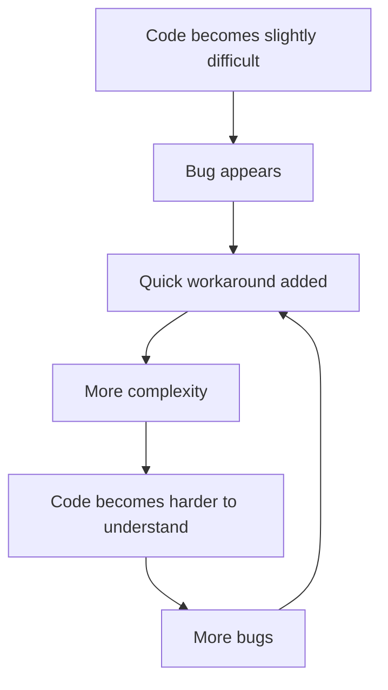
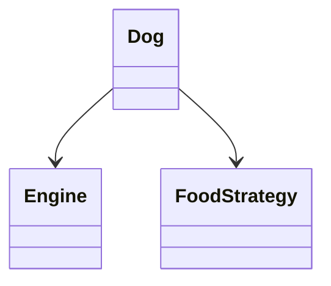
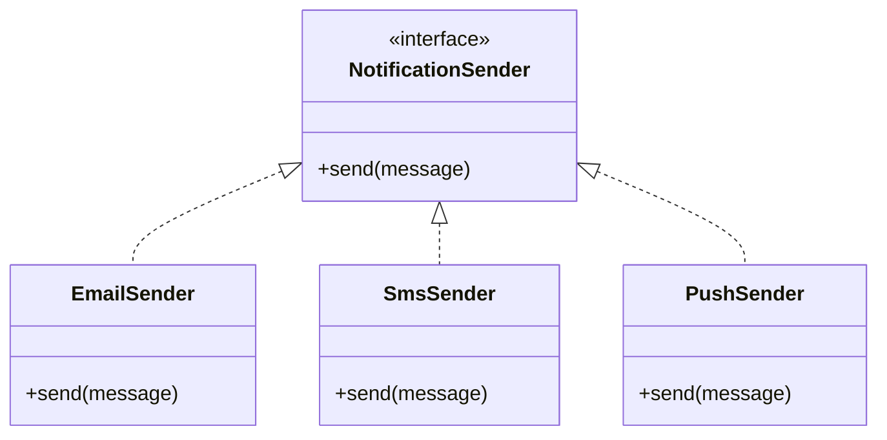

# KISS Principle

> **KISS = Keep It Simple, Stupid**

The **KISS principle** says that software should be designed and implemented as simply as possible while still satisfying all functional, reliability, security, and performance requirements.

The goal is **not** to write the least amount of code.

The goal is to write the **simplest sufficient solution**.

---

## 1. What Is the KISS Principle?

KISS is a software design principle that encourages us to avoid **unnecessary complexity**.

Good code should be:

* Easy to **read**
* Easy to **understand**
* Easy to **test**
* Easy to **debug**
* Easy to **modify**

> **Simple code → easier understanding → fewer mistakes → easier maintenance**

### Core Idea

```text
Requirement
    ↓
Understand the actual problem
    ↓
Choose the simplest sufficient design
    ↓
Implement
    ↓
Add complexity only when a real requirement demands it
```

---

## 2. Why Simplicity Matters

Complexity introduces additional places where things can go wrong.

For example:

```text
Simple Design

Calculator
   │
   └── calculate()
```

versus:

```text
Overengineered Design

Calculator
   │
   ├── OperationFactory
   │       │
   │       └── Operation
   │             ├── AddOperation
   │             ├── SubtractOperation
   │             ├── MultiplyOperation
   │             └── DivideOperation
   │
   └── OperationRegistry
```

The second design may be more flexible, but flexibility has a cost.

For a simple calculator, that additional abstraction provides little value.

---

# 3. Complexity Cycle

Unnecessary complexity often appears gradually.



This creates a **self-reinforcing complexity cycle**.

KISS attempts to break this cycle early by questioning unnecessary complexity before it becomes deeply embedded in the system.

---

# 4. Example: Calculator

Suppose we need to build a calculator supporting only:

* Addition
* Subtraction
* Multiplication
* Division

## ❌ Overengineered Solution

We could create:

```text
Operation interface
      ↑
 ┌────┼────┬────┐
 │    │    │    │
Add  Sub  Mul  Div
```

Then create a factory and a calculator that delegates operations.

This design supports adding new operations easily.

However, for only four basic operations, it introduces unnecessary:

* Interfaces
* Classes
* Abstractions
* Indirection
* Boilerplate

### Problem

A simple problem now requires understanding multiple classes before understanding one calculation.

---

# 5. Applying KISS

A simple implementation could be:

```java
class Calculator {

    public int calculate(int a, int b, String operation) {

        switch (operation) {
            case "ADD":
                return a + b;

            case "SUBTRACT":
                return a - b;

            case "MULTIPLY":
                return a * b;

            case "DIVIDE":
                return a / b;

            default:
                throw new IllegalArgumentException("Invalid operation");
        }
    }
}
```

For the current requirements, this is:

* Easy to read
* Easy to test
* Easy to debug
* Easy to understand

If the requirements later become:

> "Operations should be dynamically configurable and independently replaceable."

Then introducing a **Strategy Pattern** may become justified.

> **Don't introduce flexibility before you actually need it.**

---

# 6. KISS Does NOT Mean "No Design"

A common misunderstanding is:

> "KISS means always write the shortest code."

That's incorrect.

Consider:

```java
processOrder();
```

versus:

```java
validateOrder();
calculatePrice();
reserveInventory();
processPayment();
sendConfirmation();
```

The second version contains more code, but it may be **simpler to understand** because each operation has a clear responsibility.

Therefore:

> **Simple ≠ Short**

Instead:

> **Simple = Easy to understand and reason about**

---

# 7. Why Unnecessary Complexity Is Dangerous

## 7.1 Harder to Read

Every unnecessary abstraction increases the amount of code a developer must understand.

For example:

```text
Method
  ↓
Interface
  ↓
Factory
  ↓
Implementation
  ↓
Helper
  ↓
Actual logic
```

Instead of:

```text
Method
  ↓
Actual logic
```

---

## 7.2 More Places for Bugs

More classes and layers mean more places where defects can exist.

```text
More Code
   ↓
More Moving Parts
   ↓
More Possible Failure Points
```

The objective isn't literally "fewer lines at any cost", but avoiding code that provides no corresponding value.

---

## 7.3 Slower Developer Onboarding

Imagine a new developer joining the team.

### Simple system

```text
OrderService
    ↓
processOrder()
```

They can understand the flow quickly.

### Complex system

```text
OrderController
    ↓
OrderFacade
    ↓
OrderFactory
    ↓
OrderStrategy
    ↓
OrderProcessor
    ↓
OrderRepository
```

The developer must understand several abstractions before understanding the actual business logic.

---

## 7.4 Poor Debuggability

Simple code:

```text
Request
  ↓
Method
  ↓
Bug
```

Complex code:

```text
Request
  ↓
Controller
  ↓
Facade
  ↓
Factory
  ↓
Strategy
  ↓
Decorator
  ↓
Proxy
  ↓
Service
  ↓
Bug
```

Debugging becomes significantly harder.

---

# 8. Signs You Are Violating KISS

Watch out for these warning signs:

### 🚩 1. Interface Before Multiple Implementations

```java
interface UserNameProvider {
    String getName();
}
```

If there is only ever going to be one implementation and no meaningful abstraction boundary, this may be unnecessary.

---

### 🚩 2. "Just in Case" Layers

```text
Controller
    ↓
Facade
    ↓
Manager
    ↓
Service
    ↓
Helper
```

Ask:

> Does every layer provide meaningful value?

If not, simplify.

---

### 🚩 3. Unnecessary Reflection

Using reflection for something that can be solved with a normal method call can make the system harder to understand and debug.

---

### 🚩 4. Too Many Optional Parameters

Example:

```java
createUser(
    name,
    email,
    phone,
    age,
    address,
    city,
    state,
    country,
    ...
);
```

A design with many optional parameters may indicate that the API needs simplification or a more appropriate object.

---

### 🚩 5. Deeply Nested Conditions

```java
if (a) {
    if (b) {
        if (c) {
            if (d) {
                // ...
            }
        }
    }
}
```

Look for opportunities to simplify the control flow.

---

### 🚩 6. Recursion When a Loop Is Clearer

Recursion is useful when the problem is naturally recursive.

But using recursion merely to appear clever can violate KISS.

---

### 🚩 7. More Boilerplate Than Business Logic

```text
Business Logic       → 20 lines
Abstraction/Boilerplate → 200 lines
```

This is a strong signal to reconsider the design.

---

# 9. How to Apply KISS

## 9.1 Write Code for Humans

Code is primarily read by developers.

Prefer:

```java
customerOrderTotal
```

over:

```java
x
```

Good naming reduces the amount of mental effort needed to understand the code.

---

## 9.2 Avoid Premature Abstraction

Don't create abstractions merely because:

> "We might need this someday."

For example:

```text
Current Requirement:
One PaymentGateway
```

Don't automatically create:

```text
PaymentGateway
    ↑
StripeGateway
RazorpayGateway
PaypalGateway
CashGateway
CryptoGateway
...
```

unless the requirements actually justify those variations.

---

## 9.3 Favor Composition Over Deep Inheritance

Deep inheritance hierarchies can make behavior difficult to trace.

Instead of:

```text
Animal
  ↓
Mammal
  ↓
Pet
  ↓
DomesticPet
  ↓
Dog
  ↓
SpecialDog
```

prefer smaller objects that collaborate:



Composition allows behavior to be assembled without creating large inheritance trees.

---

## 9.4 Keep Functions Focused

A function should ideally perform one clear task.

### ❌ Complex

```java
public void processOrder(Order order) {
    // validate order
    // calculate price
    // save order
    // charge payment
    // send email
}
```

### ✅ Simpler

```java
public void processOrder(Order order) {

    validateOrder(order);
    calculatePrice(order);
    saveOrder(order);
    processPayment(order);
    sendConfirmation(order);
}
```

The overall process is now easier to understand.

---

## 9.5 Use Familiar Constructs

Prefer well-known language constructs when they solve the problem adequately.

For example:

```java
List<User> users;
Map<String, User> usersById;
for (User user : users) {
    // ...
}
```

Don't introduce a custom abstraction when a standard Java collection or construct already expresses the requirement clearly.

---

# 10. KISS and Abstraction

Abstraction is **not bad**.

The problem is **unnecessary abstraction**.

### Bad abstraction

```text
Requirement
    ↓
One implementation
    ↓
Interface
    ↓
Abstract class
    ↓
Factory
```

No real variation exists.

### Useful abstraction

```text
Requirement
    ↓
Multiple implementations
    ↓
Interface
    ↓
Strategy / Factory
```

The abstraction now solves a real problem.

> **Abstraction should emerge from a genuine need, not speculation.**

---

# 11. When NOT to Simplify

KISS should not be applied blindly.

Some complexity is necessary.

## 11.1 Security-Critical Systems

Security often requires:

* Input validation
* Authentication
* Authorization
* Encryption
* Auditing
* Error handling

Removing these simply to make the code "simpler" would be dangerous.

---

## 11.2 Payment Systems

Payment processing may require:

```text
Validation
    ↓
Authorization
    ↓
Transaction
    ↓
Failure Handling
    ↓
Retry / Recovery
    ↓
Logging / Audit
```

This is more complex than a simple calculator because the problem itself is more complex.

---

## 11.3 Reliability Requirements

Production systems may require:

* Retries
* Timeouts
* Circuit breakers
* Validation
* Observability
* Error recovery

These add complexity, but the complexity is **justified by requirements**.

---

# 12. KISS vs Over-Simplification

There are two extremes:

```text
Overengineering                    Oversimplification
      │                                  │
      ▼                                  ▼
Too much complexity             Too little protection
      │                                  │
      ▼                                  ▼
Hard to maintain                 Bugs / security issues
```

The correct point is:

```text
        SIMPLEST SUFFICIENT DESIGN
                  ▲
                  │
       ┌──────────┴──────────┐
       │                     │
   Avoid unnecessary      Keep required
     complexity             complexity
```

> **The goal is not maximum simplicity. The goal is appropriate simplicity.**

---

# 13. KISS and DRY

KISS and DRY complement each other.

### DRY

> **Don't Repeat Yourself**

Avoid unnecessary duplication.

### KISS

> **Keep It Simple**

Avoid unnecessary complexity.

Sometimes following one principle incorrectly can violate the other.

### Example

Suppose validation logic appears in five places.

You might think:

> "I don't want a utility method because that adds abstraction."

But duplicating the same logic five times can make the system harder to maintain.

A small shared method may actually produce a **simpler overall design**.

```text
DRY
 ↓
Remove unnecessary duplication
 ↓
KISS
 ↓
Keep the resulting design understandable
```

---

# 14. KISS vs YAGNI

These principles are closely related.

| Principle | Main Question                                   |
| --------- | ----------------------------------------------- |
| **KISS**  | Can this design be simpler?                     |
| **YAGNI** | Do we actually need this feature?               |
| **DRY**   | Is the same knowledge unnecessarily duplicated? |

### Example

You need one payment provider.

### YAGNI asks:

> Do we need support for five payment providers right now?

**No.**

### KISS asks:

> Can we implement the current payment requirement without unnecessary abstractions?

**Yes.**

### DRY asks:

> Are we repeating payment-related rules unnecessarily?

**Avoid that.**

---

# 15. KISS in LLD Interviews

KISS is particularly important during Low-Level Design interviews.

Interviewers generally want to see whether you can:

1. Understand requirements
2. Identify entities
3. Model relationships
4. Choose appropriate abstractions
5. Avoid unnecessary design patterns
6. Keep the design extensible where it actually matters

### Don't do this

```text
Requirement
    ↓
Design Pattern
    ↓
Find a problem for the pattern
```

### Do this

```text
Requirement
    ↓
Identify variation / complexity
    ↓
Choose appropriate design
    ↓
Introduce pattern only if justified
```

---

# 16. Example: Choosing a Design

Suppose an interviewer asks:

> "Design a simple notification system that only supports email."

### Initial design

```text
NotificationService
       ↓
EmailSender
```

This is sufficient.

Don't immediately create:

```text
NotificationService
       ↓
NotificationFactory
       ↓
NotificationStrategy
       ↓
NotificationProvider
       ↓
NotificationAdapter
       ↓
EmailSender
```

### Later Requirement

The interviewer says:

> "Now we need Email, SMS, and Push notifications."

Now abstraction becomes useful:



The design evolves **when the requirement demands it**.

---

# 17. KISS Decision Checklist

Before adding a new abstraction, ask:

```text
Do I really need this abstraction?
        │
        ├── No → Don't add it
        │
        └── Yes
              ↓
      Does it solve a real problem?
              │
              ├── No → Simplify
              │
              └── Yes
                    ↓
             Keep the abstraction
```

### Practical questions

* Can I solve this with a simpler class?
* Do I actually need an interface?
* Do I actually have multiple implementations?
* Do I need this design pattern?
* Can another developer understand this quickly?
* Is this abstraction solving a current requirement?
* Am I designing for a hypothetical future?
* Is the complexity required for security or reliability?

---

# 18. KISS Mental Model

Remember:

```text
                KISS
                 │
        ┌────────┴────────┐
        │                 │
     Avoid              Keep
 unnecessary          necessary
 complexity           complexity
        │                 │
        ▼                 ▼
   Less indirection   Requirements
   Clear naming       Security
   Small functions    Reliability
   Simple flow        Performance
```

---

# 19. Common Interview Questions

### Q1. What is the KISS principle?

**Answer:**

> KISS stands for **Keep It Simple, Stupid**. It encourages developers to choose the simplest design that satisfies the actual requirements while avoiding unnecessary abstractions and complexity.

---

### Q2. Does KISS mean writing fewer lines of code?

**Answer:**

No.

KISS means making the system **easy to understand, maintain, test, and debug**.

Fewer lines do not necessarily mean simpler code.

---

### Q3. Is abstraction against KISS?

No.

Abstraction is useful when it solves a real problem such as:

* Multiple implementations
* Required extensibility
* Separation of responsibilities
* Dependency management

KISS discourages **premature or unnecessary abstraction**, not abstraction itself.

---

### Q4. How is KISS different from YAGNI?

**KISS** asks:

> "Can I make this design simpler?"

**YAGNI** asks:

> "Do I need this functionality at all?"

---

### Q5. How does KISS help in LLD interviews?

It prevents overengineering.

Instead of immediately introducing multiple design patterns, first build the simplest design that satisfies the requirements and then introduce abstractions when actual variation or complexity requires them.

---

# 20. Quick Revision

| Concept              | Key Point                                           |
| -------------------- | --------------------------------------------------- |
| **KISS**             | Keep the design as simple as reasonably possible    |
| **Goal**             | Easy to read, understand, test, debug and modify    |
| **Avoid**            | Unnecessary abstractions and indirection            |
| **Abstraction**      | Use when there is a real need                       |
| **Inheritance**      | Avoid unnecessarily deep hierarchies                |
| **Functions**        | Keep responsibilities focused                       |
| **Critical systems** | Don't remove required safety/reliability complexity |
| **DRY**              | Avoid unnecessary duplication                       |
| **YAGNI**            | Don't build functionality before it is needed       |

---

# 21. Final Takeaways

> **1. Simple code is easier to understand.**

> **2. Avoid abstractions created only for hypothetical future requirements.**

> **3. Don't confuse simplicity with fewer lines of code.**

> **4. Prefer clear, familiar language constructs.**

> **5. Keep functions focused and easy to reason about.**

> **6. Favor composition over unnecessarily deep inheritance.**

> **7. Complexity is justified when requirements such as security, reliability, or scalability demand it.**

> **8. In LLD interviews, start simple and evolve the design when requirements introduce real variation.**

---

## One-Line Interview Answer

> **"KISS means choosing the simplest sufficient design that solves the current problem, avoiding unnecessary abstractions and complexity while retaining complexity that is genuinely required by the system."**
