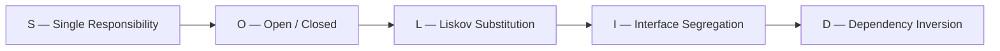
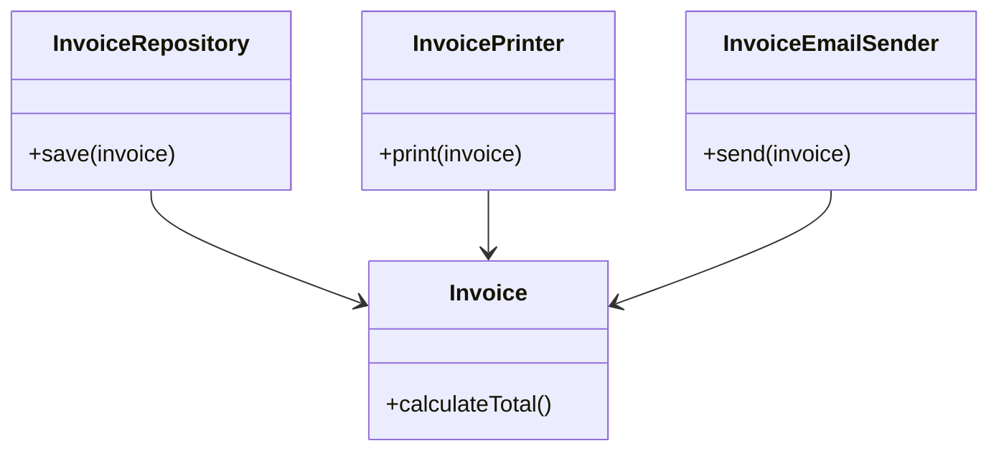
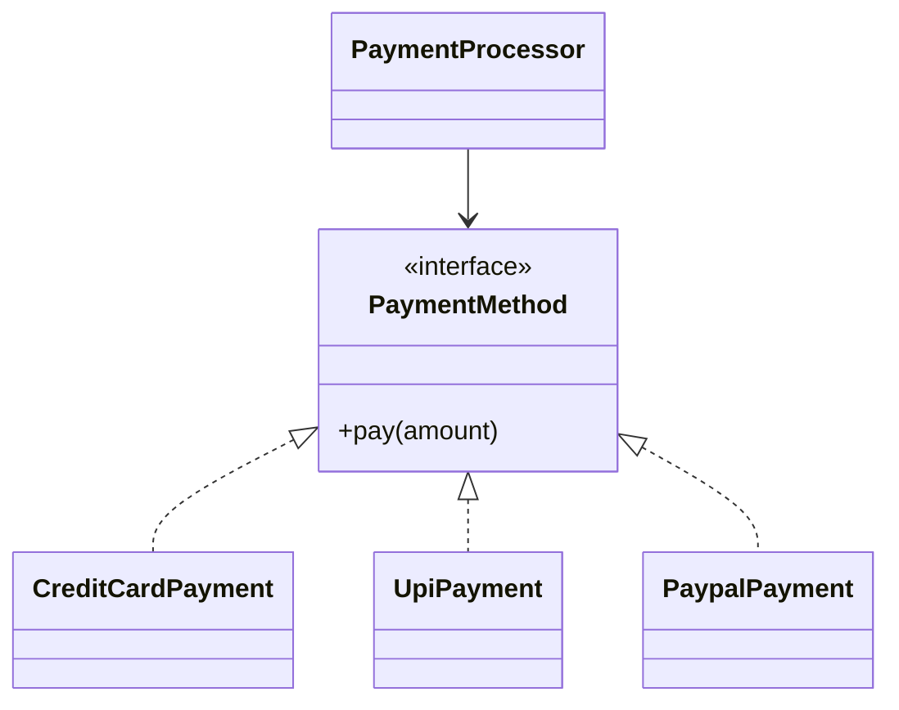
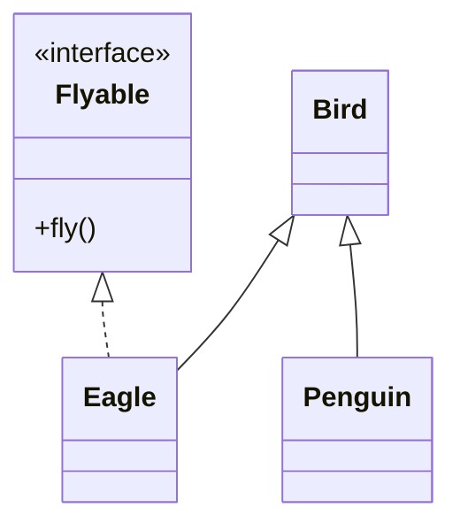
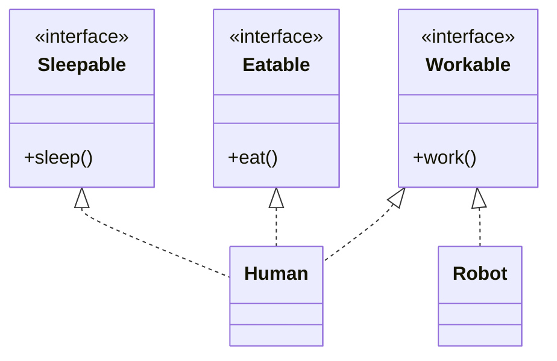
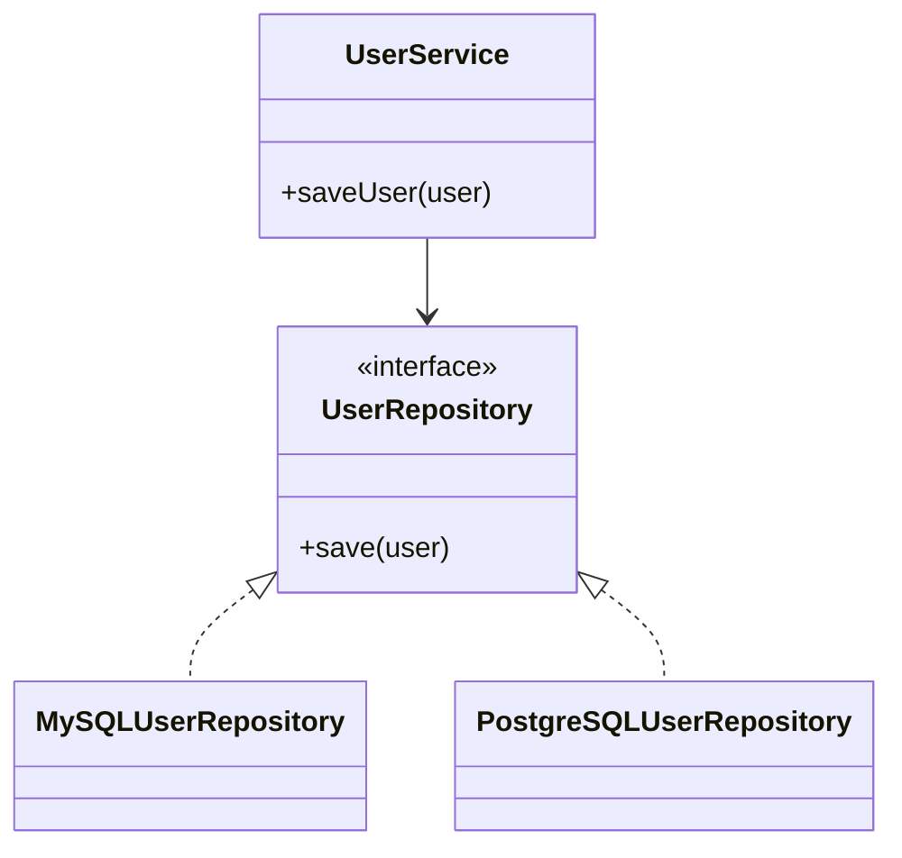
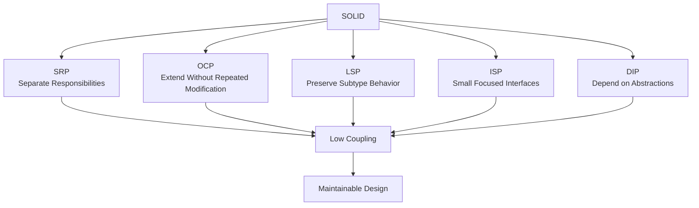

# SOLID Principles

> **SOLID** is a set of five object-oriented design principles that help make software easier to **understand, maintain, extend, test, and modify**.

The five principles are:

| Letter | Principle                       | Core Idea                                                    |
| ------ | ------------------------------- | ------------------------------------------------------------ |
| **S**  | Single Responsibility Principle | One class should have one reason to change                   |
| **O**  | Open/Closed Principle           | Open for extension, closed for modification                  |
| **L**  | Liskov Substitution Principle   | Subtypes should be safely substitutable for their base types |
| **I**  | Interface Segregation Principle | Don't force clients to depend on methods they don't use      |
| **D**  | Dependency Inversion Principle  | Depend on abstractions, not concrete implementations         |



> **Interview Mental Model:**
> SOLID is not about blindly following five rules. It is about reducing **coupling, fragility, and unnecessary dependencies** while making change safer.

---

# 1. S — Single Responsibility Principle

## Definition

> **A class should have one responsibility and therefore one reason to change.**

A class should focus on **one cohesive responsibility** instead of becoming responsible for unrelated concerns.

### ❌ Violation

Imagine an `Invoice` class that:

* Calculates invoice totals
* Saves invoices to the database
* Prints invoices
* Sends emails

```java
class Invoice {

    public double calculateTotal() {
        // calculate invoice
        return 0;
    }

    public void saveToDatabase() {
        // database logic
    }

    public void printInvoice() {
        // printing logic
    }

    public void sendEmail() {
        // email logic
    }
}
```

There are several independent reasons for this class to change:

```text
Invoice
   │
   ├── Pricing changes
   ├── Database changes
   ├── Printing changes
   └── Email changes
```

This creates unnecessary coupling.

---

## Applying SRP

Separate the responsibilities:

```java
class Invoice {
    public double calculateTotal() {
        return 0;
    }
}

class InvoiceRepository {
    public void save(Invoice invoice) {
        // database logic
    }
}

class InvoicePrinter {
    public void print(Invoice invoice) {
        // printing logic
    }
}

class InvoiceEmailSender {
    public void send(Invoice invoice) {
        // email logic
    }
}
```

Now:



Each class has a focused responsibility.

---

## Why SRP Matters

Without SRP:

```text
One Class
   │
   ├── Business logic
   ├── Database logic
   ├── Presentation logic
   └── Notification logic
          ↓
     High coupling
          ↓
     Risky changes
```

With SRP:

```text
Business Logic ──→ Invoice
Database Logic ──→ Repository
Printing Logic ──→ Printer
Email Logic ─────→ EmailSender
```

A change to email functionality doesn't require modifying invoice calculation logic.

---

## Important Clarification

SRP does **not** mean:

> "Every class should contain exactly one method."

It means:

> **A class should represent one cohesive responsibility.**

A class can have many methods as long as they support the same responsibility.

---

## Interview Answer

> **SRP states that a class should have one responsibility and one reason to change. It helps reduce coupling and makes changes safer because unrelated functionality is separated.**

---

# 2. O — Open/Closed Principle

## Definition

> **Software entities should be open for extension but closed for modification.**

In simple terms:

```text
New Requirement
      ↓
Add new behavior
      ↓
Avoid changing stable existing behavior
```

The goal is to make new functionality possible without repeatedly modifying existing, already-tested code.

---

## Example: Payment Processing

Suppose we initially support only credit-card payments.

### ❌ Violation

```java
class PaymentProcessor {

    public void process(String type) {

        if (type.equals("CREDIT_CARD")) {
            // process credit card
        }
        else if (type.equals("PAYPAL")) {
            // process PayPal
        }
        else if (type.equals("UPI")) {
            // process UPI
        }
    }
}
```

Every time we add a payment method, we modify the existing class.

```text
Add UPI
  ↓
Modify PaymentProcessor

Add PayPal
  ↓
Modify PaymentProcessor

Add Crypto
  ↓
Modify PaymentProcessor
```

This violates the spirit of OCP.

---

## Applying OCP

Create an abstraction:

```java
interface PaymentMethod {
    void pay(double amount);
}
```

Implement different payment methods:

```java
class CreditCardPayment implements PaymentMethod {

    @Override
    public void pay(double amount) {
        // credit card payment
    }
}
```

```java
class UpiPayment implements PaymentMethod {

    @Override
    public void pay(double amount) {
        // UPI payment
    }
}
```

```java
class PaypalPayment implements PaymentMethod {

    @Override
    public void pay(double amount) {
        // PayPal payment
    }
}
```

The processor depends on the abstraction:

```java
class PaymentProcessor {

    private final PaymentMethod paymentMethod;

    public PaymentProcessor(PaymentMethod paymentMethod) {
        this.paymentMethod = paymentMethod;
    }

    public void process(double amount) {
        paymentMethod.pay(amount);
    }
}
```

Now adding another payment method doesn't require modifying `PaymentProcessor`.



---

## OCP in One Picture

```text
                    PaymentMethod
                         ▲
              ┌──────────┼──────────┐
              │          │          │
         CreditCard     UPI       PayPal
              │          │          │
              └──────────┼──────────┘
                         │
                  New implementation
                         │
                    No change to
                 PaymentProcessor
```

---

## OCP Does NOT Mean

> "Never modify existing code."

Existing code sometimes **must** change because requirements or defects require it.

The principle means that the design should allow common forms of extension without forcing repeated modifications to stable code.

---

## Common Techniques for OCP

OCP is commonly supported through:

* Interfaces
* Polymorphism
* Composition
* Strategy Pattern
* Factory Pattern
* Dependency Injection

---

## Interview Answer

> **OCP means that existing behavior should remain stable while new behavior can be introduced through extension, commonly using abstractions and polymorphism.**

---

# 3. L — Liskov Substitution Principle

## Definition

> **Objects of a subtype should be usable wherever objects of the base type are expected without breaking the correctness of the program.**

In simple terms:

```text
If B is a subtype of A:

A object
   ↓
Can be replaced by
   ↓
B object

without unexpected behavior
```

The original article explains this using the idea that a child class should preserve the expected behavior of its parent.

---

# 4. Classic Example: Rectangle and Square

A common example is:

```text
Rectangle
    ▲
    │
  Square
```

Mathematically, a square is a rectangle.

But in software design, problems can arise if `Rectangle` exposes independent width and height mutation.

```java
class Rectangle {

    protected int width;
    protected int height;

    public void setWidth(int width) {
        this.width = width;
    }

    public void setHeight(int height) {
        this.height = height;
    }

    public int getArea() {
        return width * height;
    }
}
```

Suppose:

```java
Rectangle rectangle = new Square();

rectangle.setWidth(5);
rectangle.setHeight(10);
```

A caller using the `Rectangle` contract may reasonably expect:

```text
width = 5
height = 10
area = 50
```

But a `Square` must keep:

```text
width = height
```

So the subtype changes the expected behavior.

That indicates the abstraction is problematic.

---

# 5. Another LSP Violation: Bird Example

Suppose:

```java
class Bird {
    public void fly() {
        // fly
    }
}
```

Then:

```java
class Penguin extends Bird {

    @Override
    public void fly() {
        throw new UnsupportedOperationException();
    }
}
```

Now:

```java
Bird bird = new Penguin();
bird.fly();
```

The base class promises:

> A bird can fly.

But the subtype cannot honor that behavior.

Therefore:

```text
Bird
  ▲
  │
Penguin
  │
  └── Cannot satisfy fly()
```

This is a violation of LSP.

---

# 6. Better Design

Instead of putting `fly()` into the base `Bird` class:

```java
interface Flyable {
    void fly();
}
```

Then:

```java
class Eagle implements Flyable {

    @Override
    public void fly() {
        // fly
    }
}
```

While:

```java
class Penguin {
    // no fly() method
}
```

Now the abstraction accurately represents the capability.



---

# 7. LSP Violation Signals

Watch for:

### 🚩 Unsupported operations

```java
throw new UnsupportedOperationException();
```

inside overridden methods.

### 🚩 Unexpected exceptions

A subtype throws exceptions that callers don't expect from the base type.

### 🚩 Stronger Preconditions

The subtype requires more conditions than the parent.

### 🚩 Weaker Postconditions

The subtype doesn't provide guarantees expected from the parent.

### 🚩 Type Checking

Code such as:

```java
if (object instanceof SomeChildClass) {
    // special behavior
}
```

can sometimes indicate that the abstraction is incorrect.

---

## Interview Answer

> **LSP says that a subtype must honor the behavioral contract of its parent so that clients can use the subtype wherever the parent is expected without unexpected behavior.**

---

# 8. I — Interface Segregation Principle

## Definition

> **Clients should not be forced to depend on methods they do not use.**

Instead of creating one large interface:

```text
Large Interface
 ├── methodA()
 ├── methodB()
 ├── methodC()
 ├── methodD()
 └── methodE()
```

split it into smaller, focused interfaces.

---

# 9. Example: Worker Interface

### ❌ Bad Design

```java
interface Worker {

    void work();

    void eat();

    void sleep();
}
```

Now suppose we create a robot:

```java
class Robot implements Worker {

    public void work() {
        // work
    }

    public void eat() {
        // Robot doesn't eat
    }

    public void sleep() {
        // Robot doesn't sleep
    }
}
```

The robot is forced to implement methods it doesn't need.

---

# 10. Applying ISP

Split the interfaces:

```java
interface Workable {
    void work();
}
```

```java
interface Eatable {
    void eat();
}
```

```java
interface Sleepable {
    void sleep();
}
```

Now:

```java
class Human implements Workable, Eatable, Sleepable {

    public void work() {}

    public void eat() {}

    public void sleep() {}
}
```

Robot only needs:

```java
class Robot implements Workable {

    public void work() {}
}
```

---

## Diagram



---

# 11. Large Interface vs Segregated Interfaces

### ❌ Fat Interface

```text
              Worker
        ┌──────┼──────┐
        ↓      ↓      ↓
      work    eat   sleep
        │      │      │
      Human  Human  Human
      Robot  Robot  Robot
```

Robot is forced to support unnecessary operations.

### ✅ Segregated Interfaces

```text
Workable ───────→ Human
     │
     └───────────→ Robot

Eatable ─────────→ Human

Sleepable ───────→ Human
```

Each client depends only on what it needs.

---

## Interview Answer

> **ISP says that a class should not be forced to depend on methods it doesn't need. Large interfaces should be split into smaller, cohesive interfaces.**

---

# 12. D — Dependency Inversion Principle

## Definition

DIP has two important parts:

> **1. High-level modules should not depend on low-level modules. Both should depend on abstractions.**

> **2. Abstractions should not depend on details. Details should depend on abstractions.**

The key goal is to reduce direct coupling between high-level business logic and implementation details.

---

# 13. High-Level vs Low-Level Modules

### High-Level Module

Contains important business logic.

Example:

```text
OrderService
PaymentService
NotificationService
```

### Low-Level Module

Provides implementation details.

Example:

```text
MySQLRepository
StripePayment
EmailSender
```

---

# 14. DIP Violation

Suppose:

```java
class MySQLDatabase {
    public void save(String data) {
        // save to MySQL
    }
}
```

And:

```java
class UserService {

    private MySQLDatabase database;

    public UserService() {
        database = new MySQLDatabase();
    }

    public void saveUser(String user) {
        database.save(user);
    }
}
```

Now:

```text
UserService
    │
    └──────→ MySQLDatabase
```

`UserService` is tightly coupled to MySQL.

If we move to PostgreSQL:

```text
UserService
    ↓
??? 
```

we need to modify `UserService`.

---

# 15. Applying DIP

Introduce an abstraction:

```java
interface UserRepository {
    void save(String user);
}
```

Implement it:

```java
class MySQLUserRepository implements UserRepository {

    @Override
    public void save(String user) {
        // MySQL implementation
    }
}
```

Another implementation:

```java
class PostgreSQLUserRepository implements UserRepository {

    @Override
    public void save(String user) {
        // PostgreSQL implementation
    }
}
```

Now:

```java
class UserService {

    private final UserRepository repository;

    public UserService(UserRepository repository) {
        this.repository = repository;
    }

    public void saveUser(String user) {
        repository.save(user);
    }
}
```

The dependency direction becomes:



---

# 16. Dependency Injection vs Dependency Inversion

These concepts are related but **not identical**.

### Dependency Inversion Principle

A **design principle**:

```text
High-level
    ↓
Abstraction
    ↑
Low-level
```

### Dependency Injection

A **technique** for providing dependencies from outside:

```java
UserService service =
    new UserService(new MySQLUserRepository());
```

So:

```text
DIP = Principle

Dependency Injection = Technique
```

Dependency Injection is one common way to implement DIP.

---

# 17. Why DIP Matters

Without DIP:

```text
Business Logic
      ↓
Concrete Implementation
      ↓
Infrastructure
```

With DIP:

```text
              Abstraction
              ▲        ▲
              │        │
      High-Level     Low-Level
       Module        Module
```

This makes it easier to:

* Replace implementations
* Unit test business logic
* Mock dependencies
* Change infrastructure
* Reduce coupling

---

# 18. Real-World Example

Consider a notification service.

### ❌ Tight Coupling

```java
class NotificationService {

    private EmailSender sender = new EmailSender();

    public void notifyUser(String message) {
        sender.send(message);
    }
}
```

Problems:

```text
NotificationService
        ↓
    EmailSender
```

It is directly coupled to email.

---

### ✅ DIP

```java
interface NotificationSender {
    void send(String message);
}
```

Implementations:

```java
class EmailSender implements NotificationSender {
    public void send(String message) {
        // email
    }
}
```

```java
class SmsSender implements NotificationSender {
    public void send(String message) {
        // SMS
    }
}
```

Service:

```java
class NotificationService {

    private final NotificationSender sender;

    public NotificationService(NotificationSender sender) {
        this.sender = sender;
    }

    public void notifyUser(String message) {
        sender.send(message);
    }
}
```

Now:

```text
                 NotificationSender
                    <<interface>>
                   ▲            ▲
                   │            │
              EmailSender   SmsSender
                   ▲
                   │
          NotificationService
```

The high-level service doesn't care **how** the notification is sent.

---

# 19. The Five Principles Together

SOLID principles work together to address different design problems.



---

# 20. SOLID in One Example

Consider an e-commerce system.

```text
                  OrderService
                       │
                       │
                OrderRepository
                       │
                <<interface>>
                       ▲
              ┌────────┴────────┐
              │                 │
        MySQLRepository    MongoRepository
```

### SRP

`OrderService` handles order-related business logic.

`OrderRepository` handles persistence.

---

### OCP

Add a new repository implementation without changing the service.

---

### LSP

Every repository implementation must honor the expected repository contract.

---

### ISP

Don't create one giant interface containing unrelated operations.

Instead:

```text
OrderReader
OrderWriter
OrderDeleter
```

where appropriate.

---

### DIP

`OrderService` depends on:

```java
OrderRepository
```

instead of:

```java
MySQLRepository
```

---

# 21. SOLID vs Design Patterns

SOLID principles are **not design patterns**.

| SOLID                            | Design Patterns                            |
| -------------------------------- | ------------------------------------------ |
| Design principles                | Reusable design solutions                  |
| Explain **why** a design is good | Explain **how** to structure a solution    |
| SRP, OCP, LSP, ISP, DIP          | Strategy, Factory, Observer, Adapter, etc. |

For example:

```text
OCP
 ↓
Need interchangeable behavior
 ↓
Strategy Pattern
```

A design pattern can help implement a principle, but the principle itself is not the pattern.

---

# 22. Common SOLID Mistakes

## ❌ Mistake 1: SRP = One Method Per Class

Wrong.

SRP is about **responsibility**, not method count.

---

## ❌ Mistake 2: OCP = Never Modify Existing Code

Wrong.

Real systems inevitably require modifications.

OCP means designing common extension points so that adding new behavior doesn't unnecessarily require modifying stable code.

---

## ❌ Mistake 3: LSP = Only Inheritance Syntax

Wrong.

LSP is primarily about **behavioral substitutability**, not simply using `extends`.

---

## ❌ Mistake 4: ISP = Make Every Interface Tiny

Not necessarily.

The goal is **cohesive interfaces**, not artificially splitting every method into its own interface.

---

## ❌ Mistake 5: DIP = Always Create an Interface

Wrong.

An interface should be introduced when it provides a useful abstraction or decoupling boundary.

Creating interfaces everywhere can become unnecessary complexity.

---

## ❌ Mistake 6: SOLID Means More Classes

Not necessarily.

Following SOLID may sometimes introduce additional classes or interfaces, but the objective is **better separation and lower coupling**, not increasing the class count.

---

# 23. How to Identify SOLID Violations in Interviews

When reviewing a design, ask:

### SRP

> Does this class have multiple unrelated reasons to change?

### OCP

> Will adding a new variation require repeatedly modifying stable code?

### LSP

> Can every subtype honor the expectations of the parent abstraction?

### ISP

> Are implementations forced to depend on methods they don't need?

### DIP

> Is business logic directly coupled to infrastructure or implementation details?

---

# 24. SOLID Quick Revision

| Principle   | Question to Ask                                                     |
| ----------- | ------------------------------------------------------------------- |
| **S — SRP** | Does this class have more than one responsibility/reason to change? |
| **O — OCP** | Can I add behavior without unnecessarily modifying stable code?     |
| **L — LSP** | Can the subtype safely replace the parent type?                     |
| **I — ISP** | Am I forcing clients to depend on unused methods?                   |
| **D — DIP** | Does high-level code depend directly on concrete details?           |

---

# 25. Easy Way to Remember SOLID

```text
S → Single Responsibility
    "One class, one responsibility."

O → Open/Closed
    "Add behavior without unnecessary modification."

L → Liskov Substitution
    "Child should behave like its parent contract."

I → Interface Segregation
    "Don't force clients to implement what they don't need."

D → Dependency Inversion
    "Depend on abstractions, not concrete details."
```

---

# 26. SOLID Interview Cheat Sheet

### S — Single Responsibility

```text
One class
    ↓
One cohesive responsibility
    ↓
One primary reason to change
```

### O — Open/Closed

```text
Existing behavior
      ↓
Keep stable
      +
New behavior
      ↓
Extend
```

### L — Liskov Substitution

```text
Parent reference
      ↓
Child object
      ↓
Expected behavior still works
```

### I — Interface Segregation

```text
Large Interface
      ↓
Split into focused interfaces
      ↓
Clients depend only on what they need
```

### D — Dependency Inversion

```text
High-Level Module
       ↓
   Abstraction
       ↑
Low-Level Module
```

---

# 27. Final Takeaways

> **SRP** → Keep responsibilities focused.

> **OCP** → Design stable behavior so new variations can be added safely.

> **LSP** → Subtypes must preserve the behavioral expectations of their abstractions.

> **ISP** → Prefer focused interfaces over large interfaces that force unused dependencies.

> **DIP** → Separate business logic from implementation details through abstractions.

The overall objective of SOLID is:

```text
        SOLID
          ↓
   Lower Coupling
          ↓
   Better Cohesion
          ↓
   Safer Changes
          ↓
 Easier Testing & Maintenance
          ↓
   Flexible LLD Design
```

---

## One-Line Interview Answer

> **"SOLID is a set of five object-oriented design principles that help us build software with better cohesion, lower coupling, safer extensibility, and easier maintenance."**
