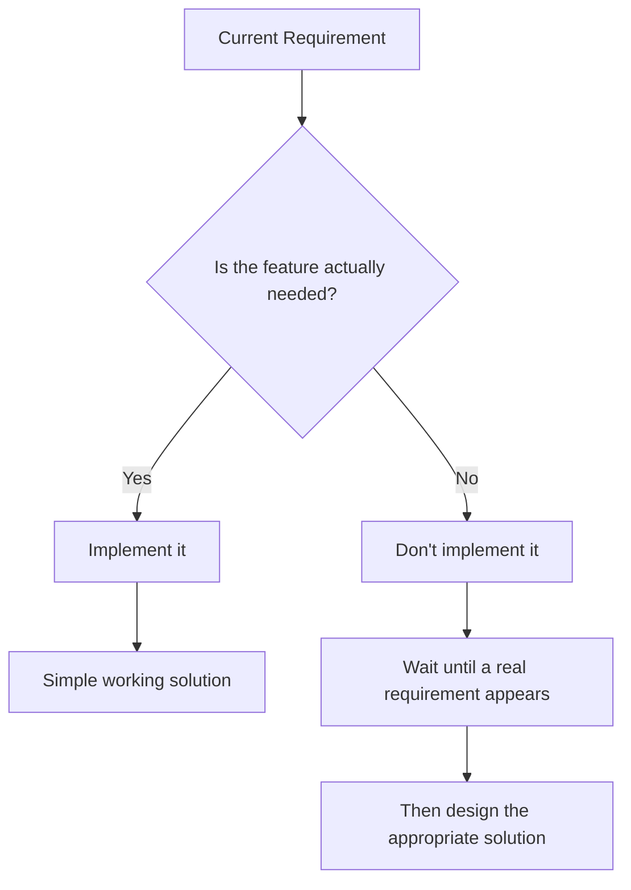
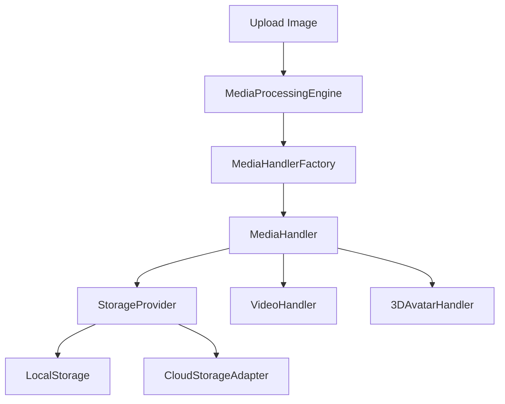
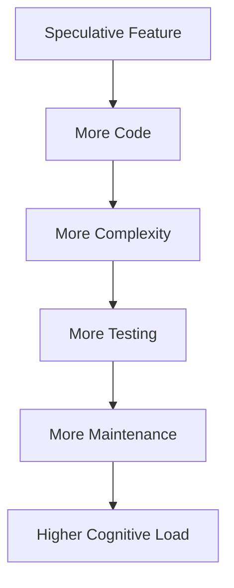
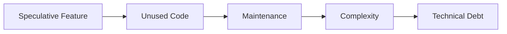
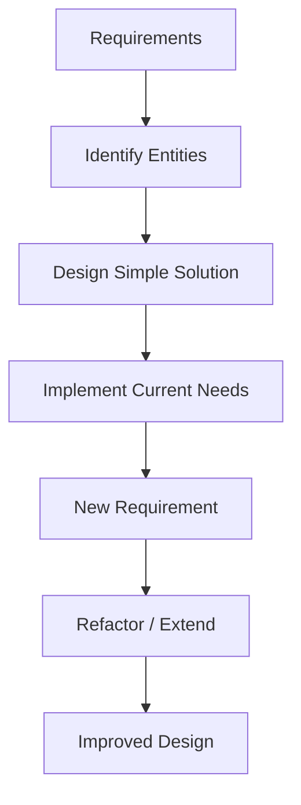
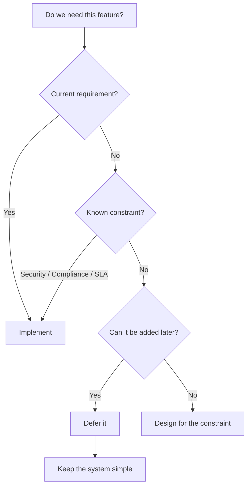

# YAGNI Principle

> **YAGNI = You Aren't Gonna Need It**

YAGNI is a software design principle that says:

> **Don't implement something until you actually need it.**

In other words:

```text
Don't build for an imagined future.
Build what is required today.
```

YAGNI is about avoiding **speculative features, unnecessary abstractions, and premature flexibility**.

It is closely associated with **Extreme Programming (XP)**, where the idea is to build the simplest solution that satisfies the current requirements and evolve it when real requirements emerge.

---

# 1. What Is YAGNI?

Imagine you're building a profile-picture upload feature.

The actual requirement is:

```text
1. Accept an image
2. Resize it to 300 × 300
3. Store it locally
```

That's all the system needs today.

But you start thinking:

```text
"What if we support videos later?"

"What if we move to cloud storage?"

"What if users upload 3D avatars?"

"What if other teams want custom handlers?"
```

You might then create:

```text
MediaHandler
MediaHandlerFactory
StorageProvider
CloudStorageAdapter
LocalStorageAdapter
PluginSystem
```

even though none of these are required.

That's a **YAGNI violation**.

---

# 2. Core Idea



The principle can be summarized as:

```text
Real requirement
      ↓
Implement
      ↓
Use feedback
      ↓
Requirement changes
      ↓
Refactor / extend
```

Instead of:

```text
Imagined requirement
      ↓
Build abstraction
      ↓
Maybe never used
      ↓
More complexity
      ↓
More maintenance
```

---

# 3. YAGNI Is Not "Write Bad Code"

A common misunderstanding is:

> "If I follow YAGNI, I should write the simplest possible code even if it isn't well designed."

That's incorrect.

YAGNI does **not** mean:

* Ignore clean code
* Ignore good architecture
* Write unmaintainable code
* Ignore known requirements
* Avoid abstraction completely

It means:

> **Don't add complexity for requirements that don't exist yet.**

There is a big difference between:

### Good Design

```text
Clean
Readable
Testable
Maintainable
```

and:

### Overengineering

```text
Clean
Readable
Testable
+
Unnecessary abstractions
+
Unused flexibility
+
Speculative features
```

---

# 4. YAGNI vs Overengineering

Suppose the requirement is:

```text
Store profile pictures locally.
```

### Simple design

```text
ProfileService
      ↓
LocalFileStorage
```

This is enough.

### Overengineered design

```text
                    MediaService
                         ↓
                 MediaHandlerFactory
                         ↓
                  MediaHandler
                         ↓
                StorageProvider
                  ↙          ↘
          LocalStorage    CloudStorage
                               ↓
                        CloudStorageAdapter
```

The second design might look more "architectural", but if cloud storage isn't required, all that extra structure provides little value.

---

# 5. Real Example — Image Upload

Let's compare the two approaches.

## Requirement

The system needs to:

```text
Accept image
    ↓
Resize to 300 × 300
    ↓
Store locally
```

---

## YAGNI Violation

A developer might create:

```text
MediaHandler
MediaHandlerFactory
StorageProvider
LocalStorage
CloudStorageAdapter
MediaProcessingEngine
```

even though only local image storage is required.



Many of these components don't solve an actual current problem.

---

# 6. YAGNI Applied

Instead, start with what is actually needed:

```java
public class ProfileImageService {

    public void uploadImage(Image image) {

        Image resized = resize(image, 300, 300);

        saveToLocalFileSystem(resized);
    }

    private Image resize(Image image, int width, int height) {
        // Resize image
        return image;
    }

    private void saveToLocalFileSystem(Image image) {
        // Save image locally
    }
}
```

The implementation is:

* Small
* Easy to understand
* Easy to test
* Easy to debug
* Sufficient for the current requirement

---

# 7. "But What If We Need Cloud Storage Later?"

This is the most common objection.

You might think:

```text
"What if we move to AWS S3 next year?"
```

YAGNI says:

> **Don't build the abstraction today solely because you might need it tomorrow.**

When the requirement actually arrives:

```text
Current requirement
       ↓
Local storage
       ↓
New requirement
       ↓
Cloud storage required
       ↓
Refactor
       ↓
Storage abstraction
```

At that point, you'll have more information about:

* Which cloud provider
* Required APIs
* Authentication
* Retry behavior
* File metadata
* Storage lifecycle
* Failure handling

So the abstraction you build **later** is likely to be better than the abstraction you guessed at today.

---

# 8. Why Premature Work Is Harmful

Adding unnecessary functionality isn't free.

Every extra class, interface, abstraction, and configuration option introduces some cost.



There are four major problems.

---

# 9. Wasted Time and Effort

If the feature isn't required, development effort is being spent on something that provides no current value.

For example:

```text
Required:
Image upload → 1 day

Speculative:
Image upload
+ cloud abstraction
+ plugin system
+ multiple handlers
+ factories
→ 5 days
```

The additional work doesn't provide value to today's users.

That time could instead be spent on:

* Improving the current feature
* Testing
* Bug fixing
* Performance
* Other business requirements

---

# 10. Increased Complexity

Every unnecessary abstraction adds another concept that developers need to understand.

Compare:

```text
ProfileService
      ↓
LocalStorage
```

with:

```text
ProfileService
      ↓
MediaProcessingEngine
      ↓
MediaHandlerFactory
      ↓
MediaHandler
      ↓
StorageProvider
      ↓
StorageAdapter
```

The second version creates more mental overhead.

A new developer may ask:

> Why are there six classes for uploading one image?

---

# 11. Delayed Value

Speculative features can delay the delivery of real features.

```text
                    Development Time
                         │
        ┌────────────────┴────────────────┐
        ↓                                 ↓
Required Features                 Speculative Features
        ↓                                 ↓
   User value                         No current value
```

A good engineering principle is:

> **Deliver useful functionality as early as possible.**

YAGNI helps prevent spending large amounts of time on hypothetical requirements.

---

# 12. Higher Maintenance Cost

Unused code still has a cost.

Suppose you created:

```text
LocalStorage
CloudStorage
StorageProvider
```

but only `LocalStorage` is being used.

You still have to:

* Understand the code
* Maintain dependencies
* Update APIs
* Fix vulnerabilities
* Review changes
* Maintain tests

```text
Unused Code
     ↓
Still requires maintenance
     ↓
Technical debt
```

> **Dead or unused code is not free.**

---

# 13. YAGNI and Technical Debt

Unnecessary features can become technical debt.



The dangerous part is that once unnecessary code exists, developers may hesitate to remove it.

They think:

> "Maybe someone will need this later."

Eventually, the speculative implementation becomes permanent.

---

# 14. YAGNI and Abstraction

One of the most important applications of YAGNI in LLD is **avoiding premature abstraction**.

Suppose we have only one implementation:

```java
class EmailNotification {
    public void send(String message) {
        // Send email
    }
}
```

A developer might immediately create:

```java
interface Notification {
    void send(String message);
}
```

and:

```java
class EmailNotification implements Notification {
}
```

This can be reasonable if polymorphism is already required.

But if there is:

```text
Only one implementation
+
No known requirement for another
+
No current need for substitution
```

then the interface may be unnecessary.

---

# 15. Premature Factory Pattern

Another common example is introducing a factory when there is only one implementation.

Instead of:

```java
EmailSender sender = new EmailSender();
```

someone might create:

```text
NotificationFactory
        ↓
Notification
        ↓
EmailSender
```

with:

```java
Notification notification =
    NotificationFactory.create("EMAIL");
```

If the system only supports email and there is no current requirement for multiple notification types, this adds unnecessary complexity.

Later, if SMS and Push notifications are actually required:

```text
Email
SMS
Push
```

then introducing a factory or strategy-based design may make sense.

---

# 16. YAGNI vs Future-Proofing

Future-proofing sounds attractive:

> "Let's make the system flexible so we don't have to change it later."

But there is a problem.

You don't know exactly what the future requirement will be.

```text
Today's assumption
       ↓
"Maybe we'll need X"
       ↓
Build for X
       ↓
Future actually needs Y
       ↓
X abstraction doesn't help
       ↓
Refactor anyway
```

So speculative flexibility can actually make future changes **harder**.

---

# 17. YAGNI Does Not Mean Ignore Known Constraints

YAGNI has important exceptions.

The key distinction is:

```text
Known requirement
       vs
Speculative requirement
```

### Known

```text
"The system must support cross-region replication."
```

### Speculative

```text
"Maybe we'll need cross-region replication someday."
```

These should not be treated the same way.

---

# 18. When You Should Bend YAGNI

## 18.1 Security and Compliance

Security requirements should not be postponed simply because they aren't directly visible to users.

For example:

* Encryption
* Access control
* Audit logging
* Data protection
* Compliance requirements

If the system is required to protect sensitive data, these requirements are **known constraints**, not speculative features.

```text
Security Requirement
        ↓
Known Requirement
        ↓
Implement from the beginning
```

---

# 19. Known Architectural Constraints

Sometimes the architecture must account for requirements known in advance.

For example:

```text
System must provide:
99.99% availability
+
Cross-region replication
+
Specific SLA
```

If these are contractual or explicitly required, designing for them from the beginning is justified.

Retrofitting such requirements later can be significantly more expensive.

```text
Known HA requirement
       ↓
Design for HA early
```

This is different from:

```text
"Maybe we'll need HA someday."
```

---

# 20. Libraries and Frameworks

YAGNI can be applied somewhat differently when building a reusable library or framework.

If other teams will consume your API:

```text
Your Library
     ↓
Multiple Consumers
```

API design and compatibility matter more.

However, even here:

> **Start with a minimal API and expand it based on real usage.**

Don't add dozens of configuration options simply because someone *might* want them.

---

# 21. YAGNI vs DRY

YAGNI and DRY are complementary principles, but they can sometimes pull you in different directions.

### DRY

Says:

> Avoid duplicating knowledge.

### YAGNI

Says:

> Don't introduce abstractions until there is a real need.

Example:

```text
Code appears twice
        ↓
DRY → "Maybe extract it."
        ↓
YAGNI → "Is it actually the same concept?"
```

The correct answer may be:

> Wait until you know the duplication represents the same business knowledge.

This prevents premature abstraction.

---

# 22. YAGNI vs KISS

These principles work very well together.

### KISS

> **Keep It Simple, Stupid.**

Focuses on keeping the solution simple.

### YAGNI

> **You Aren't Gonna Need It.**

Focuses on avoiding unnecessary features and flexibility.

Together:

```text
YAGNI
  ↓
Don't build unnecessary things
  ↓
KISS
  ↓
Keep what you build simple
```

---

# 23. YAGNI in LLD Interviews

YAGNI is particularly useful during Low-Level Design interviews.

Suppose the interviewer asks:

> "Design a notification system."

Don't immediately build:

```text
NotificationFactory
NotificationStrategy
NotificationRegistry
PluginManager
ProviderFactory
EventBus
MessageBroker
TemplateEngine
```

before understanding the requirements.

Instead:

### Step 1

Identify the actual requirements.

```text
Email notification required
```

### Step 2

Build the simplest clean solution.

```text
NotificationService
       ↓
EmailSender
```

### Step 3

If the interviewer adds:

```text
"Now support SMS and Push."
```

then evolve the design:

```text
             Notification
             /     |      \
            /      |       \
        Email      SMS     Push
```

The design grows **because the requirements grow**.

---

# 24. Requirement-Driven Design

A useful LLD mindset is:



This is much safer than:

```text
Imagine every possible future
        ↓
Build everything now
        ↓
Hope it's useful later
```

---

# 25. Practical Decision Checklist

Before adding a feature, abstraction, interface, or flexibility, ask:

### Question 1

**Is it required by the current specification?**

```text
YES → Consider implementing
NO  → Continue questioning
```

### Question 2

**Is it required by security, compliance, SLA, or another known constraint?**

```text
YES → Implement
NO  → Continue
```

### Question 3

**Is there an actual current use case?**

```text
YES → Implement
NO  → Don't build it yet
```

### Question 4

**Am I adding it because of "what if"?**

```text
"What if we need it later?"
             ↓
        YAGNI warning ⚠️
```

### Question 5

**Can the requirement be added later without unreasonable cost?**

If yes, defer it.

---

# 26. YAGNI Decision Tree



---

# 27. Good vs Bad YAGNI

| Situation                        | Decision              |
| -------------------------------- | --------------------- |
| Required feature                 | ✅ Build it            |
| Security requirement             | ✅ Build it            |
| Compliance requirement           | ✅ Build it            |
| Contractual SLA                  | ✅ Design for it       |
| Known architectural constraint   | ✅ Design for it       |
| "Maybe we'll need it"            | ❌ Don't build yet     |
| Unused interface                 | ⚠️ Question it        |
| Factory with one implementation  | ⚠️ Question it        |
| Empty methods for future use     | ❌ Avoid               |
| Plugin system with one plugin    | ❌ Usually unnecessary |
| Extra configuration nobody needs | ❌ Avoid               |

---

# 28. Common Mistakes

### Mistake 1 — Building for "What If?"

```text
"What if we need this someday?"
```

This is one of the strongest YAGNI warning signs.

---

### Mistake 2 — Creating Empty Abstractions

```java
interface StorageProvider {
    void store();
    void retrieve();
    void delete();
}
```

If the application only needs:

```text
store()
```

then the other methods may be speculative.

---

### Mistake 3 — Creating Factories Too Early

```text
One implementation
       ↓
Factory
       ↓
Interface
       ↓
Implementation
```

More layers don't automatically mean better design.

---

### Mistake 4 — Supporting Unrequested Use Cases

Examples:

```text
Video upload
3D avatars
Plugin system
Multiple cloud providers
```

when the requirement only says:

```text
Upload profile image
```

---

# 29. The Golden Rule

> **Implement what you need now. Refactor when real requirements arrive.**

Think of your design as something that should **evolve with evidence**.

```text
Requirement
     ↓
Simple design
     ↓
Real usage
     ↓
New requirement
     ↓
Refactor
     ↓
Better design
```

Not:

```text
Prediction
     ↓
Complex architecture
     ↓
Maybe useful
     ↓
Permanent complexity
```

---

# 30. Interview Questions

### Q1. What is YAGNI?

> YAGNI stands for **You Aren't Gonna Need It**. It is a principle that says we should not implement features, abstractions, or flexibility until there is a real requirement for them.

---

### Q2. Does YAGNI mean we should never plan for the future?

**No.**

YAGNI means avoiding **speculative future requirements**.

If a future requirement is already known because of:

* Security
* Compliance
* SLA
* Contractual requirements
* Known architectural constraints

then it should be considered during design.

---

### Q3. Why is premature abstraction bad?

Because it introduces complexity before we understand the actual requirements.

The future requirement may be different from what we predicted, meaning the abstraction may:

* Never be used
* Be difficult to understand
* Require maintenance
* Still need to be replaced later

---

### Q4. How does YAGNI relate to LLD?

In LLD, YAGNI helps prevent:

* Unnecessary interfaces
* Unused design patterns
* Premature factories
* Speculative extensibility
* Unused configuration
* Excessive abstraction

Start with the simplest clean design that satisfies the requirements and evolve it when requirements change.

---

### Q5. Does YAGNI conflict with DRY?

Not necessarily.

DRY says:

> Don't duplicate the same knowledge.

YAGNI says:

> Don't create abstractions for requirements that don't exist.

When two pieces of code look similar, don't automatically abstract them. First determine whether they actually represent the same knowledge.

---

# 31. Quick Revision

```text
                    YAGNI
                      │
                      ↓
           You Aren't Gonna Need It
                      │
                      ↓
          Don't build speculative features
                      │
          ┌───────────┴───────────┐
          ↓                       ↓
    Real requirement        "What if...?"
          ↓                       ↓
       Build                  Don't build
                                  │
                                  ↓
                         Wait for real need
                                  │
                                  ↓
                              Refactor
```

---

# 32. Final Takeaways

> **YAGNI means: Don't add functionality, flexibility, or abstraction until a real requirement justifies it.**

Remember:

1. **YAGNI = You Aren't Gonna Need It.**
2. Build for **today's real requirements**, not imaginary future requirements.
3. Avoid speculative features and premature abstractions.
4. Extra code creates extra **complexity and maintenance cost**.
5. Unused code is still technical debt.
6. Don't create interfaces, factories, or plugin systems without a real reason.
7. The **simplest clean solution** is usually a good starting point.
8. When requirements change, **refactor and extend** the design.
9. YAGNI does not mean writing bad or careless code.
10. Security, compliance, SLA, and other **known constraints** can justify planning ahead.
11. Even reusable libraries should start with a **minimal API** and evolve based on actual needs.
12. In LLD interviews, let the **requirements drive the architecture**.

---

## One-Line Interview Answer

> **YAGNI (You Aren't Gonna Need It) is a design principle that encourages developers to implement only the functionality and abstractions required by current, known requirements rather than building speculative features for an uncertain future.**

---

## YAGNI Mental Model

```text
             Is it actually needed?
                     │
              ┌──────┴──────┐
             YES            NO
              │              │
              ↓              ↓
           Build       Is it a known
                         constraint?
                              │
                       ┌──────┴──────┐
                      YES            NO
                       │              │
                       ↓              ↓
                    Build          Defer
                                     │
                                     ↓
                              Add when needed
```

### Remember

**Don't ask:**

> "How can I make this ready for every possible future?"

Ask:

> **"What is the simplest clean design that solves the requirements we actually have?"**
